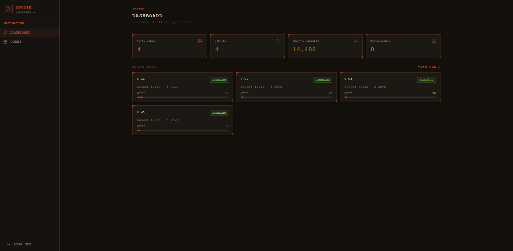

# GGPanel



[](https://github.com/RevocGG/GGoose-ui/releases/latest)
[](LICENSE)

**[English README 🇬🇧](README.md)**

داشبورد وب برای مدیریت کورهای [GooseRelayVPN](https://github.com/Kianmhz/GooseRelayVPN) و [FlowDriver](https://github.com/NullLatency/FlowDriver). ساخت، پیکربندی، شروع/توقف و مانیتور چندین تونل core از یک تب مرورگر — بدون نیاز به ترمینال.

> **موتورهای پشتیبانی‌شده:**
> - [GooseRelayVPN](https://github.com/Kianmhz/GooseRelayVPN) — VPN بر پایه SOCKS5 از طریق Google Apps Script
> - [FlowDriver](https://github.com/NullLatency/FlowDriver) — VPN بر پایه SOCKS5 از طریق Google Drive API (با OAuth2 داخلی)

---

## امکانات

- 🖥️ **رابط وب** — مدیریت همه کورها از مرورگر
- ▶️ **شروع / توقف / ریستارت** با یک کلیک
- 📋 **لاگ زنده** — خروجی بلادرنگ از طریق SSE
- 📊 **آمار مصرف** — شمارنده درخواست روزانه و کلی برای هر core
- 🔑 **چندین script key** با load balancing خودکار (GooseRelayVPN)
- 🌊 **پشتیبانی FlowDriver** — فلوی OAuth2 داخلی، آپلود credentials.json، تونلینگ از طریق Google Drive API ([FlowDriver](https://github.com/NullLatency/FlowDriver))
- 🔒 **ورود امن** — جلسه JWT با بررسی timing-safe
- 📦 **بسته آفلاین** — آرشیو آماده با Node.js تعبیه‌شده (بدون نیاز به نصب چیزی)
- 🐳 **پشتیبانی Docker** — راه‌اندازی با یک دستور با Docker Compose

----

## شروع سریع — بسته آفلاین (توصیه‌شده)

روی دستگاه مقصد به Node.js، npm یا اینترنت نیازی ندارید.

### لینوکس / مک

```bash
# بسته مناسب پلتفرم خود را از صفحه Releases دانلود کنید
tar xzf ggoose-ui-vX.Y.Z-linux-x64.tar.gz
cd ggoose-ui-vX.Y.Z-linux-x64

./install-offline.sh   # اولین راه‌اندازی (تنظیم اعتبارنامه، مقداردهی DB)
./start.sh             # شروع سرور
``` 

مرورگر را باز کنید: `http://آدرس-سرور:3000`

### ویندوز

1. فایل `.zip` را از [صفحه Releases](https://github.com/RevocGG/GGoose-ui/releases/latest) دانلود و اکسترکت کنید
2. روی **`install.bat`** دوبار کلیک کنید (اولین راه‌اندازی)
3. روی **`start.bat`** دوبار کلیک کنید تا سرور شروع شود

مرورگر را باز کنید: `http://localhost:3000`

> بسته از پیش شامل باینری `goose-client` است — نیازی به دانلود دستی نیست.

---

## شروع سریع — Docker Compose

به Docker و Docker Compose نیاز دارد (اولین بار اینترنت لازم است).

```bash
git clone https://github.com/RevocGG/GGoose-ui.git
cd GGoose-ui
cp .env.example .env
# فایل .env را ویرایش کنید — ADMIN_USERNAME، ADMIN_PASSWORD و AUTH_SECRET را تنظیم کنید
docker compose up -d
```

مرورگر: `http://localhost:3000`

برای به‌روزرسانی:

```bash
docker compose pull
docker compose up -d
```

---

## شروع سریع — از سورس

به Node.js نسخه ۲۰ به بالا و npm نیاز دارد.

```bash
git clone https://github.com/RevocGG/GGoose-ui.git
cd GGoose-ui
npm install
npx prisma generate
cp .env.example .env   # اعتبارنامه را تنظیم کنید
node scripts/setup.js  # مقداردهی اولیه DB
npm run build
node .next/standalone/server.js
```

---

## پیکربندی

فایل `.env.example` را به `.env` کپی کرده و موارد زیر را تنظیم کنید:

| متغیر | اجباری | توضیح |
|---|---|---|
| `ADMIN_USERNAME` | ✅ | نام کاربری ورود |
| `ADMIN_PASSWORD` | ✅ | رمز عبور ورود |
| `AUTH_SECRET` | ✅ | هگز تصادفی ۶۴ کاراکتری — امضای توکن JWT. با `openssl rand -hex 32` بسازید |
| `PORT` | — | پورت HTTP (پیش‌فرض `3000`) |
| `DATABASE_URL` | — | مسیر SQLite (پیش‌فرض `file:./data/goose.db`) |
| `CORES_DIR` | — | پوشه باینری‌های core (پیش‌فرض `data/cores`) |

---

## افزودن Core

### کور GooseRelayVPN 🪿

1. داشبورد → **Cores** → **New Core** → **GooseRelayVPN**
2. پر کردن فرم:
   - **Name** — نام نمایشی
   - **Binary** — نام فایل باینری `goose-client` در پوشه `data/cores/`
   - **SOCKS port** — پورت محلی (مثلاً `1080`)
   - **Script keys** — Deployment ID های Google Apps Script
   - **Tunnel key** — کلید AES هگز ۶۴ کاراکتری (باید با پیکربندی سرور VPS یکسان باشد)
3. روی **Create** کلیک کنید، سپس **Start**

### کور FlowDriver 🌊 ([FlowDriver](https://github.com/NullLatency/FlowDriver))

1. داشبورد → **Cores** → **New Core** → **FlowDriver**
2. پر کردن فرم:
   - **Name** — نام نمایشی
   - **Binary** — نام فایل باینری FlowDriver در پوشه `data/cores/`
   - **Listen Address** — آدرس SOCKS5 محلی (مثلاً `127.0.0.1:1080`)
   - **credentials.json** — فایل OAuth2 گوگل را آپلود کنید (از Google Cloud Console) یا مسیر مطلق وارد کنید
3. روی **Create** کلیک کنید، سپس **Start**
4. در اولین راه‌اندازی، یک دیالوگ احراز هویت OAuth2 ظاهر می‌شود — فلوی مرورگر را در تب Logs تکمیل کنید
5. پس از اولین احراز هویت، فایل `.token` ذخیره می‌شود — راه‌اندازی‌های بعدی خاموش هستند

---

## پلتفرم‌های پشتیبانی‌شده

| پلتفرم | بسته آفلاین | Docker |
|---|---|---|
| Linux x64 | ✅ | ✅ |
| Linux arm64 | ✅ | ✅ |
| macOS x64 (Intel) | ✅ | — |
| macOS arm64 (Apple Silicon) | ✅ | — |
| Windows x64 | ✅ | — |

---

## بیلد با GitHub Actions

با push یک تگ `vX.Y.Z` فرآیند ریلیز فعال می‌شود:

```bash
git tag v1.0.0
git push origin v1.0.0
```

این workflow:
1. بسته standalone Next.js را می‌سازد
2. باینری `goose-client` را برای هر پلتفرم از [ریلیزهای GooseRelayVPN](https://github.com/Kianmhz/GooseRelayVPN/releases/latest) دانلود می‌کند
3. باینری Node.js 22 را تعبیه می‌کند
4. آرشیو پلتفرم‌ها را می‌سازد و GitHub Release منتشر می‌کند

---

## ساختار پروژه

```
GGoose-ui/
├── src/
│   ├── app/               # صفحات و API routes مبتنی بر App Router
│   ├── components/        # کامپوننت‌های UI (cores، dashboard، auth)
│   └── lib/               # process-manager، db، config-writer، auth
├── scripts/
│   ├── setup.js           # مقداردهی اولیه DB (بدون Prisma CLI)
│   ├── install-offline.sh # راه‌اندازی اولیه برای بسته‌های آفلاین
│   ├── start.sh           # اسکریپت راه‌انداز (لینوکس/مک)
│   ├── install.bat        # راه‌اندازی اولیه (ویندوز)
│   └── start.bat          # اسکریپت راه‌انداز (ویندوز)
├── data/
│   ├── cores/             # باینری goose-client اینجا قرار می‌گیرد
│   └── configs/           # کانفیگ‌های JSON تولیدشده برای هر core
├── prisma/                # اسکیما و مایگریشن‌های Prisma
├── Dockerfile
├── docker-compose.yml
└── .github/workflows/
    └── release.yml        # Workflow بیلد و ریلیز
```

---

## حمایت از پروژه

اگر این پروژه برایتان مفید بوده، می‌توانید از توسعه آن حمایت کنید:

| شبکه | آدرس |
|---|---|
| TON | `UQBW_LoEhcYPIzZL_dzp-OMsqI5uAwv8p6dXy8wzzkPU-CQQ` |
| BNB / USDT (BEP-20) | `0x951acaf8d4b61a000d3b5c697abcabf52973d0cf` |
| TRX | `TL4Kej6DjJmT9gQ5ghmQcvsEUHPdnNNPyj` |
| SOL | `45kAfGyh13bcyYTdbNLkVfBGtMgq4WMijLgdBK9G9ugN` |

---

## پروژه‌های مرتبط

- [GooseRelayVPN](https://github.com/Kianmhz/GooseRelayVPN) — VPN SOCKS5 از طریق Google Apps Script (کلاینت + سرور + Apps Script)
- [FlowDriver](https://github.com/NullLatency/FlowDriver) — VPN SOCKS5 از طریق Google Drive API
- [MasterHttpRelayVPN](https://github.com/masterking32/MasterHttpRelayVPN) — پروژه‌ای که GooseRelayVPN از آن الهام گرفته

---

## مجوز

MIT
